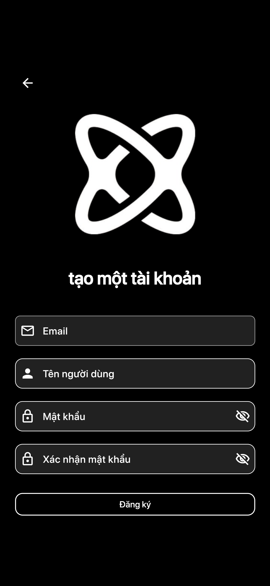
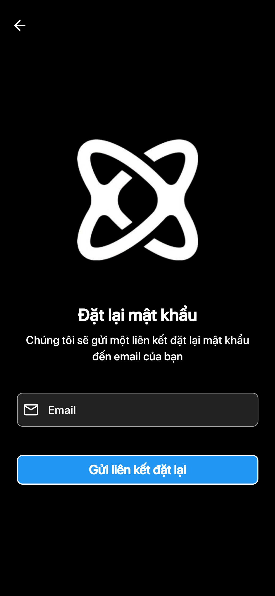
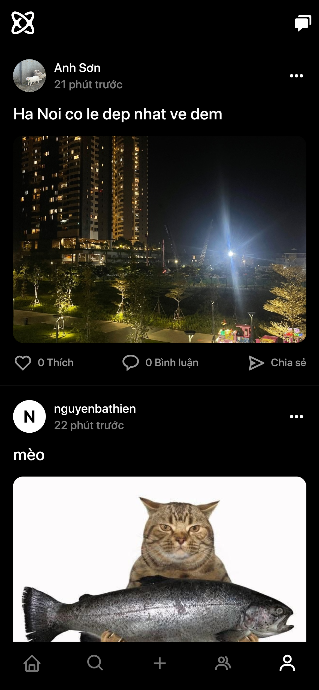
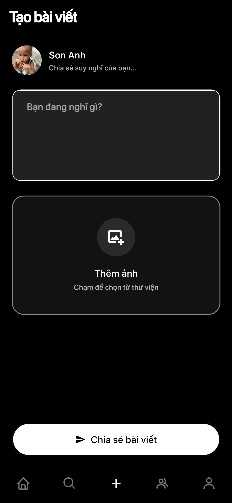
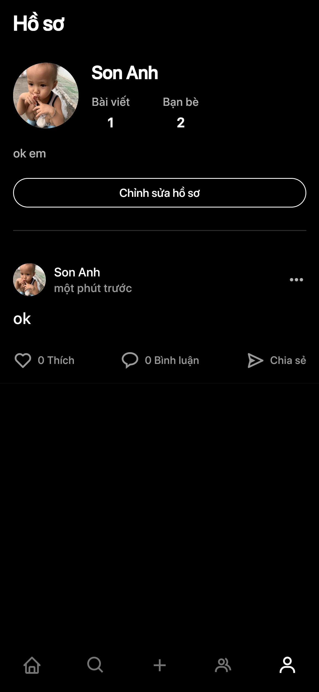
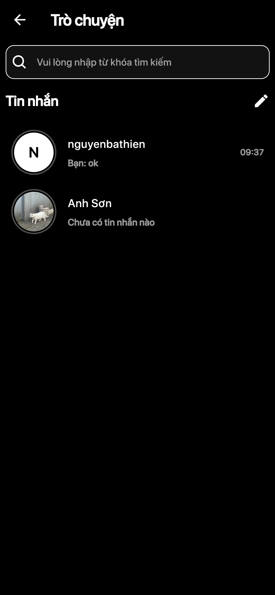

# 🚀 Social Media App

A full-featured social media application built with **Flutter** and **Firebase**, featuring real-time chat with **End-to-End Encryption (E2EE)**, posts, stories, and more.

[](https://flutter.dev)
[](https://firebase.google.com)
[](LICENSE)

---

## Screenshots

### Authentication
<table>
  <tr>
    <td></td>
    <td></td>
    <td></td>
  </tr>
  <tr>
    <td align="center">Login</td>
    <td align="center">Sign Up</td>
    <td align="center">Forgot Password</td>
  </tr>
</table>

### Main Features
<table>
  <tr>
    <td></td>
    <td></td>
    <td></td>
    <td></td>
  </tr>
  <tr>
    <td align="center">Feed</td>
    <td align="center">Create Post</td>
    <td align="center">Profile</td>
    <td align="center">E2EE Chat</td>
  </tr>
</table>

> 📸 *Add your screenshots in the `screenshots/` folder*

---

## Features

### Authentication
- Email/Password sign-up and login
- Password reset functionality
- Persistent authentication state
- Multi-language support (English, Vietnamese)

###  Posts & Feed
- Create posts with images and captions
- Like and comment on posts
- Real-time feed updates
- Follow/Unfollow users
- Friends-only feed

### Chat (End-to-End Encrypted)
- Real-time messaging with **E2EE** (RSA + AES-256)
- Auto-backup encryption keys to Firebase
- Cross-platform encryption (Web ↔ Mobile)
- Message integrity verification (HMAC-SHA256)
- Image sharing in chat

### Profile
- Customizable user profiles
- Profile picture upload
- Bio and display name
- View followers and following
- Friend requests management

### Search & Discovery
- Search users by name or username
- View other users' profiles
- Send friend requests

### UI/UX
- Dark mode / Light mode
- Responsive design (Mobile & Web)
- Smooth animations
- Modern Material Design 3

---

## Tech Stack

### Frontend
- **Flutter** 3.x - Cross-platform UI framework
- **Dart** - Programming language

### Backend & Services
- **Firebase Authentication** - User authentication
- **Cloud Firestore** - NoSQL database
- **Firebase Storage** - Image and file storage
- **Firebase Hosting** - Web deployment

### Encryption & Security
- **RSA Encryption** (1024-bit Web, 2048-bit Mobile)
- **AES-256-CBC** - Message encryption
- **HMAC-SHA256** - Message integrity
- **FlutterSecureStorage** - Secure key storage

### State Management & UI
- **Provider** - State management
- **Easy Localization** - i18n support
- **Image Picker** - Photo selection
- **Cached Network Image** - Image caching
---

## Installation & Setup

### Setup Environment Flutter 

### Firebase Setup

#### A. Create Firebase Project

1. Go to [Firebase Console](https://console.firebase.google.com/)
2. Click **"Add project"**
3. Enter project name (e.g., "SocialMediaApp")
4. Enable Google Analytics (optional)
5. Click **"Create project"**

#### B. Configure Firebase Automatically (Recommended)

Use **FlutterFire CLI** to automatically configure Firebase for all platforms:

```bash
# 1. Install FlutterFire CLI
dart pub global activate flutterfire_cli

# 2. Login to Firebase
firebase login

flutterfire configure

**Follow the prompts:**
1. Select Firebase project (or create new one)
2. Select platforms: Android, iOS, Web (use Space to select, Enter to confirm)
3. Done! All files created automatically ✨
```
**⭐ If you like this project, please give it a star!**

**🎉 Happy Coding!**
